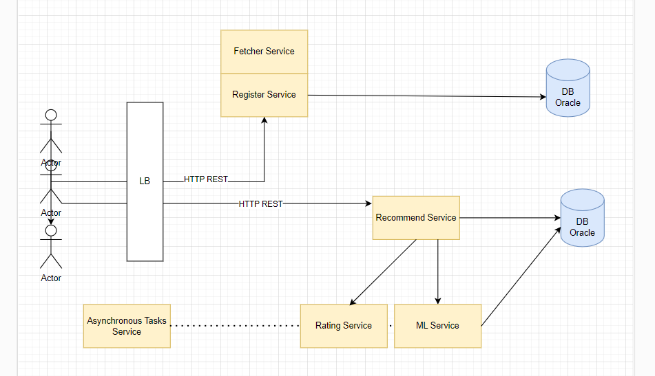

# adFluencer
advertisement from clients to influencers.

### High level architecture

### Data model

### Rating Algorithm:

The rating algorithm processed in Asynchronous task every week (can configured).

The algorithm:

Define a metric for customer engagement:

we'll consider the number of likes and comments on the influencer's advertisement as metrics for customer engagement.
Monitor customer engagement:

Whenever a customer interacts with an influencer's advertisement by liking or commenting, the engagement metrics are recorded in a database or analytics system.
Calculate an engagement score:

Let's assume that the engagement score is calculated as follows:
Each like is worth 1 point.
Each comment is worth 2 points.
The engagement score is the sum of the points earned from likes and comments.
Incorporate the engagement score into the rating update:

Update the influencer's rating by adding the engagement score to their existing rating.
For example, if the influencer's rating is initially 4 and they received an engagement score of 10, their updated rating would be 14.
Perform the rating update asynchronously:

Implement the rating update algorithm as an asynchronous task to run in the background.
This allows for efficient processing and updating of ratings for multiple influencers without impacting the main execution flow.

## diagrams
ThreadPool:

# Guide:

to register customer.

send this API-request:

http://{{ip}}:8080/register

{

    "name" : "",
    "mail" : "",
    "phone" : ""

}
